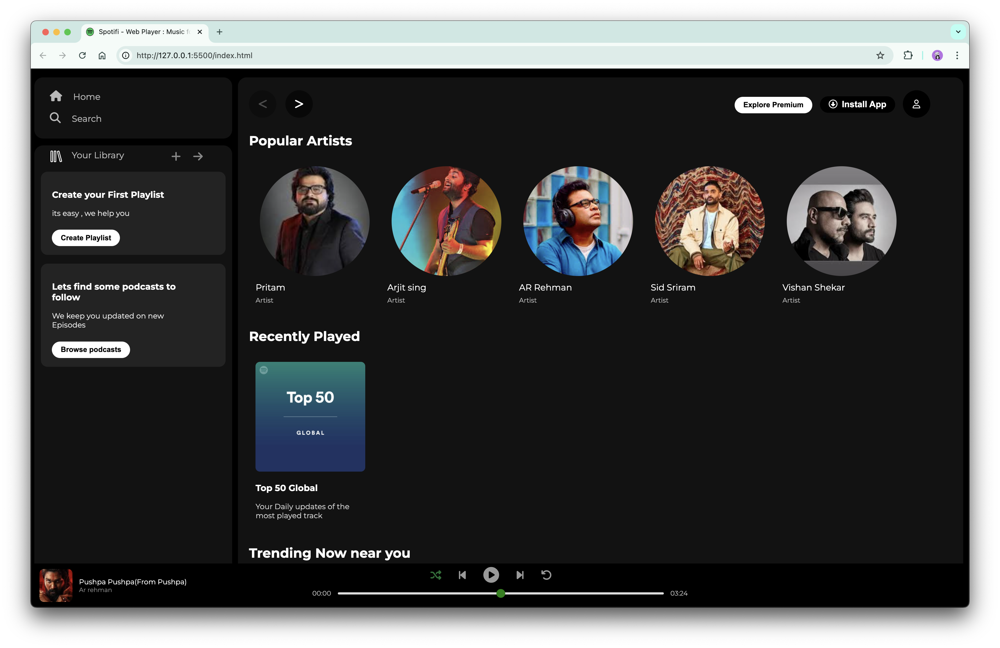

# 🎵 Spotifi Clone - HTML & CSS  

This is a **Spotify Clone UI** built using **HTML & CSS**. It replicates the look and feel of Spotify’s web player, including a sidebar, navigation bar, music player, and various sections for artists, playlists, and trending songs.  

## 🚀 Features  
- 🎨 Fully responsive UI  
- 📌 Sidebar navigation with home, search, and library options  
- 🎶 Popular artists, trending music, and featured playlists  
- 🎵 Interactive music player layout  

## 🛠️ Technologies Used  
- HTML5  
- CSS3 (Flexbox & Grid for layout)  
- Font Awesome for icons  

## 📌 Usage  
This is a **ready-to-use UI** and can be integrated with backend functionality to create a fully functional music streaming platform.  

## 📷 Preview  
  

## 💡 Future Enhancements  
- Adding JavaScript for interactivity (Play/Pause, Volume Control)  
- Implementing backend integration for real-time music streaming  

## 📩 Feedback  
Feel free to explore the project and suggest improvements! 🚀  

#HTML #CSS #WebDevelopment #SpotifyClone  
